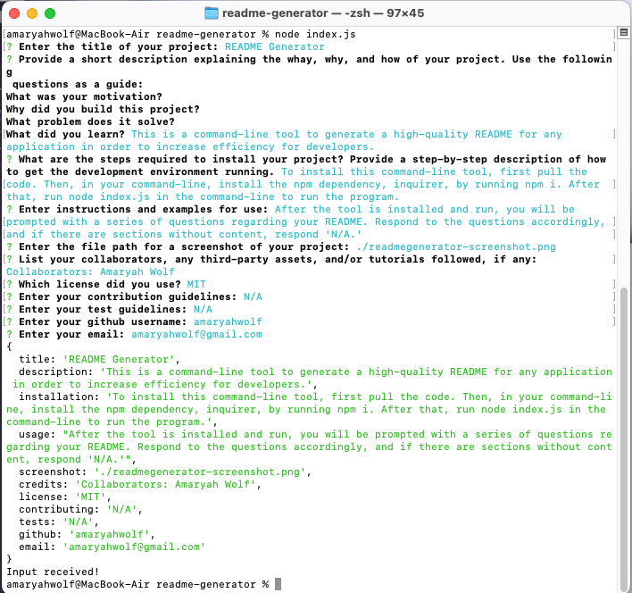

# README Generator
[](https://opensource.org/licenses/MIT)

## Description
This is a command-line tool built with Node.js and Inquirer to generate a high-quality README for any application to increase efficiency for developers.

## Table of Contents
- [Installation](#installation)
- [Usage](#usage)
- [Credits](#credits)
- [License](#license)
- [Contributing](#contributing)
- [Tests](#tests)
- [Questions](#questions)

## Installation
To install the application locally, ensure that [Node.js](https://nodejs.org/en/download/) is installed, then clone the repository from Github and run the installation script ```npm run install``` followed by the start script ```node index.js```. 

## Usage
After the tool is installed and started, you will be prompted with a series of questions regarding your README. Respond to the questions accordingly, and if there are sections without content, respond 'N/A.' After responding to all prompts, a markdown file will be created and named with the title of your application. After you have moved the file to the appropriate folder or workspace, be sure to rename the file 'README.md' to follow proper naming syntax. The generated README will include Title, License Badge, Description, Table of Contents, Installation, Usage, Credits, License, Contributing, Tests, and Questions sections.
[Video walkthrough of README Generator](https://drive.google.com/file/d/1WJxiPMeSTaFpVNFCK-rjiIzQ50bUPwyN/view?usp=share_link)


## Credits
Collaborators: Amaryah Wolf

## License
This application is covered under the MIT license.

## Contributing
[Contributor Covenant](https://www.contributor-covenant.org/version/2/1/code_of_conduct/)

## Tests
N/A

## Questions
For additional questions, find me on [github](https://github.com/amaryahwolf) or email me at amaryahwolf@gmail.com

