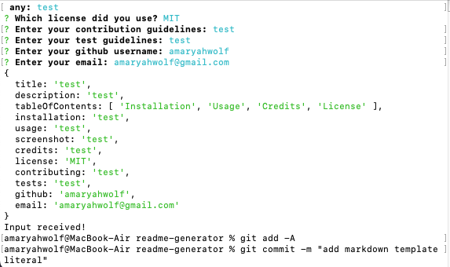

# README-Generator
 

## Description
This application generates a thorough README using the command line to increase efficiency for developers.

## Table of Contents
- [Installation](#installation)
- [Usage](#usage)
- [Credits](#credits)
- [License](#license)
- [Contributing](#contributing)
- [Tests](#tests)
- [Questions](#questions)

## Installation
N/A

## Usage
Run the application in the command line, follow the prompts and your customized README will generate.

## Credits
Amaryah Wolf

## License
## License
This application is covered under the Apache license.

## Contributing
N/A

## Tests
N/A

## Questions
For additional questions, find me on [github](https://github.com/amaryahwolf) or email me at amaryahwolf@gmail.com.
